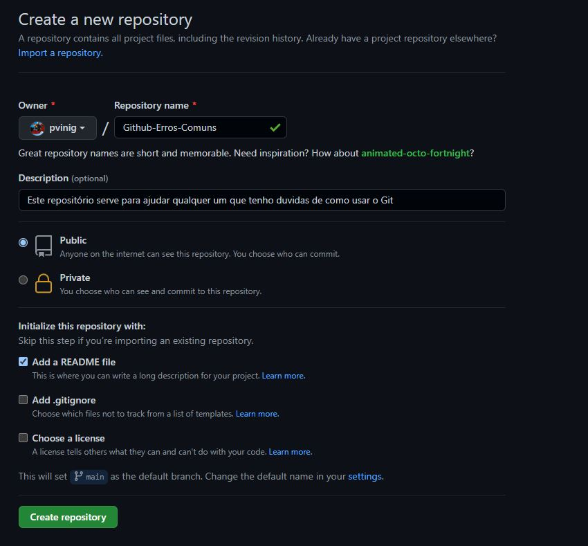

<!-- @format -->

# Principais Erros com Git: como resolver

Quem nunca esqueceu um arquivo na hora de abrir um _pull request_?
o git é uma ferramenta de controle de versão, a principal utilidade é podermos ter bom acesso ao
histórico de alterações do projeto de software.
Embora seu uso seja simples, até os devs mais experientes as vezes se veem com alguma dúvida.
então bora esclarecer algumas coisas.

## Primeiro vamos criar um repositório para exemplo.

Vamos ao [GitHub](https://github.com/), logamos e no canto esquerdo terá a opção _new_


### Selecionando o botão _New_, vamos para a janela de criação de repositórios.



Aqui eu criei um repositório [Github-Erros-Comuns](https://github.com/pvinig/Github-Erros-Comuns), adicionei uma descrição um arquivo _README_.
então eu pego o link para clonar o nosso repositório e vou para o prompt de comando
onde eu vou mudar a pasta na qual estou navegando para onde deixo meus projetos,
com o comando `cd` que significa _change directory_ , traduzindo
mudar de pasta.

```powerShell
    cd E:\underdev
```

Após, vou clonar o repositório na minha maquina local, para isto eu uso o comando

```powerShell
git clone https://github.com/pvinig/Github-Erros-Comuns.git
```

para fazer o download de outros repositórios, é só adicionar o _clone link_ ao comando `git clone`


então eu abro nosso projeto e vou fazer a primeira alteração
eu abro o meu editor de código, no meu caso [Visual Studio Code]()
