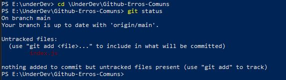

<!-- @format -->

# Principais Erros com Git: como resolver

Quem nunca esqueceu um arquivo na hora de abrir um _pull request_?
o git é uma ferramenta de controle de versão, a principal utilidade é podermos ter bom acesso ao
histórico de alterações do projeto de software.
Embora seu uso seja simples, até os devs mais experientes as vezes se veem com alguma dúvida.
então bora esclarecer algumas coisas.

## Primeiro vamos criar um repositório para exemplo.

Vamos ao [GitHub](https://github.com/), logamos e no canto esquerdo terá a opção _new_


### Selecionando o botão _New_, vamos para a janela de criação de repositórios.


Aqui eu criei um repositório [Github-Erros-Comuns](https://github.com/pvinig/Github-Erros-Comuns), adicionei uma descrição um arquivo _README_.
então eu pego o link para clonar o nosso repositório e vou para o prompt de comando
onde eu vou mudar a pasta na qual estou navegando para onde deixo meus projetos,
com o comando `cd` que significa _change directory_ , traduzindo
mudar de pasta.

```powerShell
cd E:\underdev
```

Após, vou clonar o repositório na minha maquina local, para isto eu uso o comando

```powerShell
git clone https://github.com/pvinig/Github-Erros-Comuns.git
```

para fazer o download de outros repositórios, é só adicionar o _clone link_ ao comando `git clone`


então para fazer a primeira alteração
eu abro o meu editor de código, no meu caso [Visual Studio Code](https://code.visualstudio.com/) e crio o arquivo _index.js_ e escrevo uma simples linha de código nele.

#### obs: a seta branca indica onde voce pode criar um novo arquivo no _studio code_


Com o arquivo criado e modificado. Voltamos para o prompt de comando e alteramos o diretório de navegação para dentro do repositório com o comando ` cd \underDev\Github-Erros-Comuns` , após isso vamos pedir um _status_ de como anda o projeto.

```powerShell
git status
```



Como podemos observar, o prompt nos responde que existe um _Untracked file_, um arquivo que o git ainda não está no histórico de alterções do git, para adiciona-lo eu farei o comando `add` e pedirei um `status` para o _git_ para assim fazer nosso primeiro commit.

```powerShell
git add index.js
git status
```

agora vou salvar as alterações no histórico de alterações do _gitHub_ , vou fazer o commit.

```powerShell
git commit -m "adicionado o arquivi index.js ao repositório no guto"
```

É sempre muito importante por menssagens que resumam o que você esta atualizando em cada _commit_ que você faz, assim no caso de algum _bug_ por exemplo. Você pode saber oq cada _commit_ agrega para o projeto como um todo, ficand mais facíl de localizar falhas e também fazer atualizações.

Vejam que cometi alguns erros ao fazer este commit, troquei "arquivo" por "arquiivi" assim como "GitHub" por "guto", para corregir isto, usarei o comando ` --amend` para poder reescrever a mensagem.

```powerShell
git commit --amend -m "adicionando o arquivo index.js ao repositório no GitHub"
```


Pronto! agora nosso commit está certin 🤩
